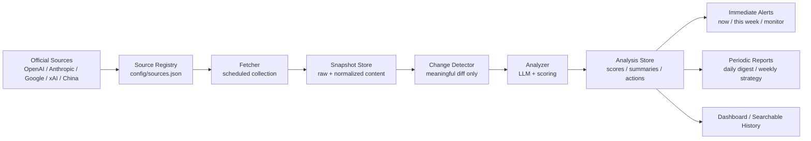
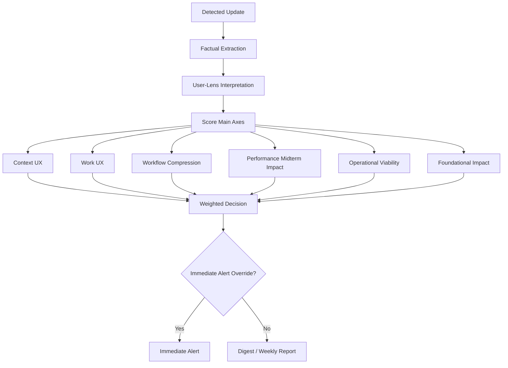
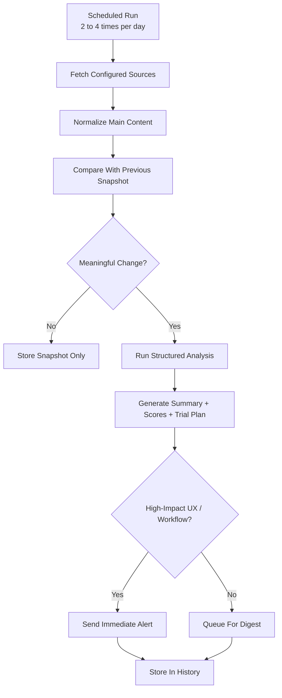
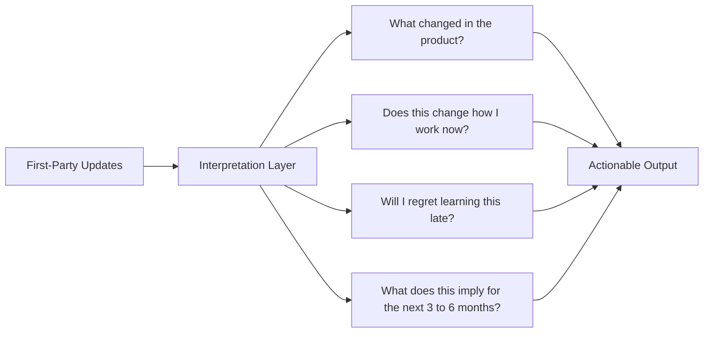
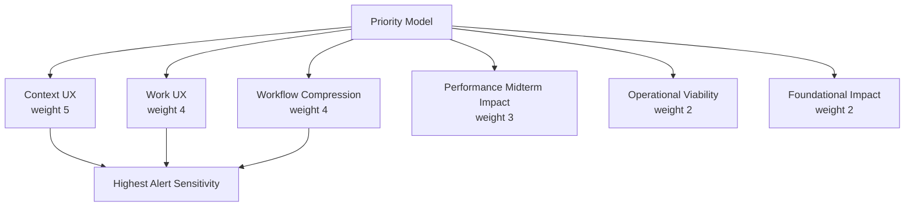
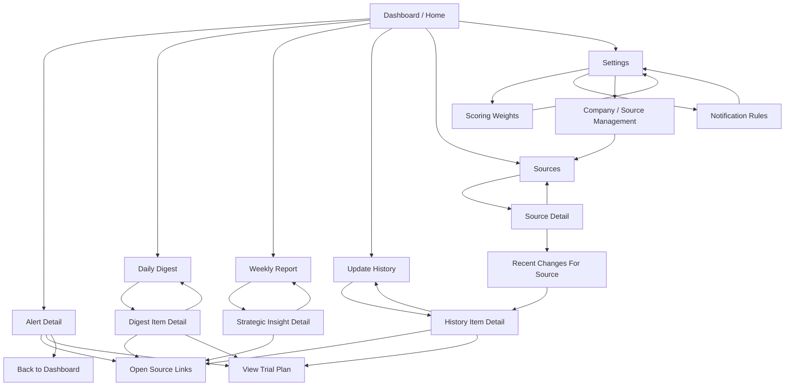
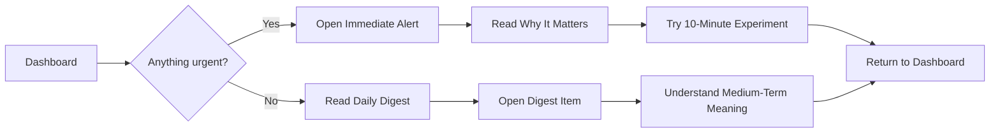

# Product Diagrams

## System Overview

## Analysis Logic

## Daily Processing Flow

## User Value Model

## Priority Weighting

## Screen Flow

## Main User Journey

## Screen Roles

- `Dashboard / Home`
  - shows today's immediate alerts, latest digest, and quick links to reports
- `Alert Detail`
  - explains what changed, why it matters, scoring, source links, and suggested next action
- `Daily Digest`
  - lists non-urgent but relevant updates from the day
- `Weekly Report`
  - summarizes strategic shifts and future implications
- `Update History`
  - searchable archive of previously analyzed updates
- `Sources`
  - manages monitored companies and source pages
- `Settings`
  - controls weights, alert thresholds, and notification behavior
